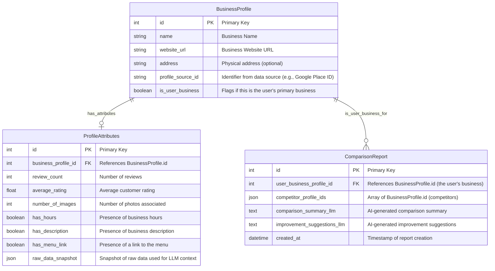

# MVP Scope Document: [Your Startup Name]

## 1. Introduction & Goals

### 1.1. Introduction
* 1.1.1. Project Purpose: Competitor Insights Assistant
* 1.1.2. Problem Statement: What problem does this solve for restaurant owners
* 1.1.3. Target User: restaurant owners evaluating their online presence

### 1.2. MVP Goals & Success Metrics
* 1.2.1. Key Objectives for this MVP (e.g., validate core comparison logic, test LLM integration viability)
* 1.2.2. Measurable Success Metrics (e.g., X users complete a comparison, qualitative feedback on suggestion usefulness)

## 2. System Architecture Overview
- High-level architecture diagram (Frontend ↔ API ↔ Data Engine ↔ External APIs).
- Component overview:
  - Backend: Django + Django REST Framework + PostgreSQL
  - Frontend: Vue + Vite + TypeScript
  - Styling: Tailwind CSS
  - UI Component Library: [e.g., PrimeVue, or "Minimal/Custom Components" if aiming for ultra-lightweight]
  - Database: PostgreSQL
  - SDKs: Python + TypeScript generated from OpenAPI specification using Stainless
  - AI Integration: LLM API (e.g., OpenAI, or specified model)
  - External Data Source: [e.g., Serper.dev or Mock Data Provider]

## 3. Authentication & Authorization
- Frontend: JWT-based authentication
- SDKs: API key authentication
- Optional: role-based access (admin, user, etc.)
- Session management (short-lived JWT, refresh if needed)

## 4. Data Model Design
- Core Entities:
  - `BusinessProfile` - Entity representing the user's business and competitor businesses
  - `ProfileAttributes` - Key metrics extracted/compared for a BusinessProfile
  - `ComparisonReport` - Stores the results of a comparison
  - `Suggestion` - AI-generated suggestions for improving the business profile

- Relationships:
  - A business can have multiple competitors
  - Each comparison yields suggestions
- DB: PostgreSQL (consider indexing key comparison fields)

## 5. Backend Scope (Django + PostgreSQL)

### 5.1. Core Responsibilities
* API for frontend requests
* Orchestrate data fetching from external sources (or mocks)
* Perform attribute comparison logic
* Integrate with LLM for summary and suggestions
* Persist comparison results (optional for absolute MVP, but good to consider)
* Validation, logging, and error handling

### 5.2. API Endpoints (to be defined in OpenAPI v3.x)
* `POST /api/v1/comparison/initiate`
  * Request: User business identifier (name/URL), list of competitor identifiers
  * Response: report_id or immediate comparison results
* `GET /api/v1/comparison/reports/{report_id}`
  * If async processing or storing reports
  * Response: Full comparison report including raw data, compared attributes, and LLM insights
* `GET /api/v1/businesses/search`
  * Optional: if implementing competitor search
  * Request: query (name/keyword), location (optional)
  * Response: List of potential business matches

### 5.3. Key Modules/Logic
* Data Fetching Service (Wrapper for Serper.dev/mock).
* Attribute Extraction & Comparison Logic.
* LLM Interaction Service (Prompt engineering, API calls).
* Data Persistence (Django ORM).

## 6. Frontend Scope (Vue + TypeScript)

### 6.1. Core User Flows
* User inputs their business details
* User inputs/selects competitor details
* User views comparison results and AI-generated suggestions

### 6.2. Key Pages/Views
* Input View: Form for business name/URL and competitor selection
* Results View: Display comparison table, AI summary, and actionable suggestions

### 6.3. Key Components
* BusinessInputForm.vue
* CompetitorSelector.vue (could be simple text inputs or more advanced)
* ComparisonDisplay.vue
* AISuggestions.vue

### 6.4. State Management
* Pinia

### 6.5. API Client
* Axios or Fetch API wrapper

### 6.6. UI/Styling Libraries

* [Vuetify](https://vuetifyjs.com/) – Material Design components
* [Tailwind CSS](https://tailwindcss.com/) – Utility-first CSS
* [UnoCSS](https://unocss.dev/) – Lightweight alternative

### 6.7. Auth handling
* JWT storage, auto-login, token refresh (if needed)

## 7. SDK Scope (Python & TypeScript)

- Maintained as a contract between backend and SDK consumers
- Expose endpoints for:
  - Submitting comparison data
  - Retrieving comparison results

### 7.1. Generation
* To be generated from the OpenAPI specification (defined in Backend Scope) using Stainless

### 7.2. Target Functionality
* Python: sdk.comparison.initiate(...), sdk.comparison.get_report(...)
* TypeScript: sdk.comparison.initiate(...), sdk.comparison.getReport(...)

### 7.3. Authentication
* API Key based, handled by generated SDK configuration

## 8. Authentication & Authorization Strategy

### 8.1. Frontend to Backend API
* Method: JWT (JSON Web Tokens) for user sessions
* Flow: User authenticates (if user accounts are part of MVP, e.g., to save reports), receives JWT, JWT sent in Authorization header for subsequent requests
* MVP Simplification: If user accounts are out of scope for the initial MVP, the frontend might operate without JWTs, relying on API keys passed directly or backend APIs being temporarily open/rate-limited by IP for demo purposes. Clarify based on "lightweight" interpretation. The prompt does mention JWT for frontend

### 8.2. SDK to Backend API
* Method: API Key
* Flow: SDK instances configured with an API key, sent in a custom header (e.g., X-API-Key) or standard Authorization: Bearer <API_KEY>

### 8.3. Backend to External Services (LLM, Serper.dev)
* Method: API Keys specific to each service, stored securely in backend configuration.

## 9. MVP Feature List Summary

| Feature                        | Backend | Frontend | SDK  |
|-------------------------------|---------|----------|------|
| Submit business info          | ✅      | ✅       | ✅   |
| Select/view competitors       | ✅      | ✅       | ✅   |
| Run profile comparison        | ✅      | -        | -    |
| Get AI-generated suggestions  | ✅      | ✅       | -    |
| Display suggestions/results   | -       | ✅       | -    |

* 1. As a restaurant owner, I can enter my business name or website to identify my business profile
* 2. As a restaurant owner, I can (optionally) enter the names or websites of my competitors
* 3. As a restaurant owner, I can trigger a comparison of my business profile against the selected competitors
* 4. As a restaurant owner, I can see a comparison of key attributes (review count & avg. rating, number of images, presence of hours, description, menu links)
* 5. As a restaurant owner, I can read an AI-generated summary highlighting key differences and areas for improvement
* 6. As a restaurant owner, I can receive concrete, AI-generated suggestions to improve my profile (e.g., "You're missing photos. Your competitors average 20+.")

## 10. Out of Scope (MVP)
- User registration or profile management (User accounts and persistent report history)
-  Automatic competitor discovery beyond manual input
-  Profile score or ranking system
-  Charts for visual comparison
-  Previewing improvements using AI-generated content
- Advanced AI features (e.g., tone toggles, image generation)
- Real-time updates or background tasks
- Analytics, dashboards
- Support for business types other than restaurants, if applicable
- Advanced error handling and UI polishing beyond basic functionality

## 11. Assumptions
* Availability and reliability of the chosen LLM API
* Availability and reliability of the business data API (e.g., Serper.dev) OR sufficiency of mock data for MVP validation
* Basic comparison logic for attributes is defined and feasible
* Stainless can successfully generate functional SDKs from the OpenAPI spec
* OpenAI integration will use simple prompts or function calling
* JWT auth is sufficient for prototype use
* MVP users are internal testers or devs

## 12. Dependencies
* [Django](https://www.djangoproject.com/) (backend framework)
* [PostgreSQL](https://www.postgresql.org/) (database)
* [Vue 3](https://vuejs.org/) (frontend framework)
* [Pinia](https://pinia.vuejs.org/) (state management)
* [Tailwind](https://tailwindcss.com/), Vuetify, or UnoCSS (styling)
* Tools:
  * [Stainless](https://stainless.io/) (SDK generation from OpenAPI)
* External APIs: LLM Provider API, Business Data API (Serper.dev or equivalent)
  * [OpenAI API](https://platform.openai.com/) (LLM integration)
  * [Serper.dev](https://serper.dev/) (external search API)

## 13. Deployment & Operations (Brief)
* Frontend Deployment: [e.g., Vercel, Netlify, S3+CloudFront]
* Backend Deployment: [e.g., Docker container on Fly.io, Heroku, AWS EC2/ECS]
* Database: [e.g., Managed PostgreSQL service like Neon (as per original WIP), AWS RDS, or self-hosted]

## Success Metrics for MVP
- Users can successfully compare a business with at least one competitor
- AI suggestions are clear and useful
- The flow from input → comparison → suggestion takes under 60 seconds
- The system is stable and ready for team onboarding and ticket creation
